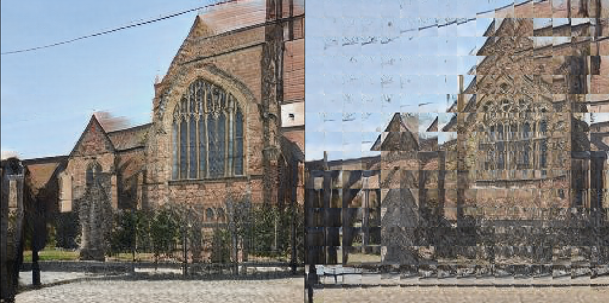
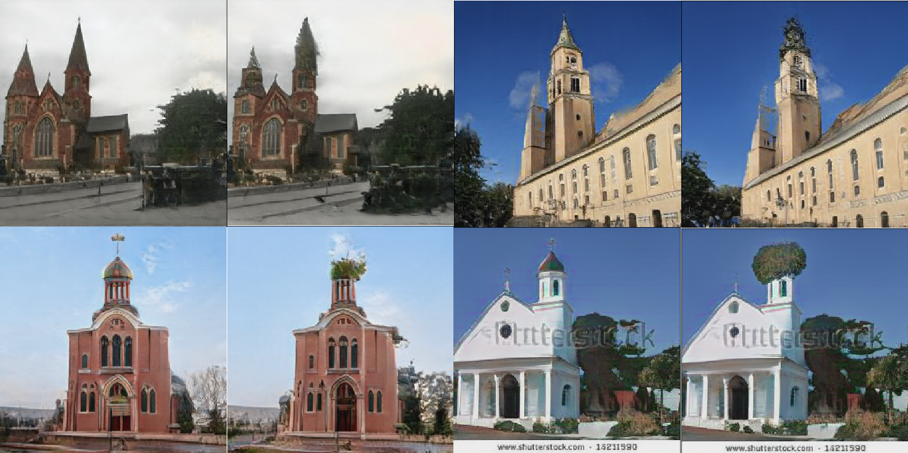

# Rewriting-A-Deep-Generative-Models

Experiments for paper "Rewriting a deep generative models" [[GIT](https://github.com/davidbau/rewriting), [arXiv:2007.15646](https://arxiv.org/abs/2007.15646)]

- This repository aims to write a single file rewriting experiment.
- StyleGAN2 is based on NVIDIA [stylegan2](https://github.com/NVlabs/stylegan2) and rosinality [stylegan2-pytorch](https://github.com/rosinality/stylegan2-pytorch).
- Each licenses are appended to [3RD-PARTY.md](./3RD-PARTY.md)

## Setup

Reference [setup.bat](./setup.bat)

1. git submodule requires to be initialized.
```
git submodule update --init
```

2. For windows, since torch cpp_extension is failed due to cp949 encodings, patch [0001-cpp-ext-Remove-and-alter-to-torch-native.patch](./patches/0001-cpp-ext-Remove-and-alter-to-torch-native.patch) annotates cpp_extension and use torch apis.
```
cd stylegan2-pytorch
git am --whitespace=fix ..\patches\0001-cpp-ext-Remove-and-alter-to-torch-native.patch 
```

3. Setting tf1.14 environments. Other requirements can be found on [setup.bat](./setup.bat)
```
pip install tensorflow-gpu==1.14
```

4. Download pretrained weights from [stylegan2](https://github.com/NVlabs/stylegan2).

5. Convert weights for [stylegan2-pytorch](https://github.com/rosinality/stylegan2-pytorch).
```
python .\stylegan2-pytorch\convert_weight.py --repo .\stylegan2 .\release\stylegan2-church-config-f.pkl
move .\stylegan2-church-config-f.pt .\release
```


## Sample - Feature independency

This paper says that some feature maps consist of less dependent features with their neighbors.

In experiment [FeatureIndependency.ipynb](./FeatureIndependency.ipynb), features are patched and inferenced isolately. But image represents such a good objects lack of softness.

We can assume that each features encode the object, and interprete convolution as perspective of associative memory, from disentangling the neighbors, to blending the outputs.



## Sample - Rewriting

Optimize a convolutional weight with direction of ZCA whitened C^{-1}k.

Since some feature maps consist of less dependent features, we can mask the feature maps directly with interpolated image-level mask. Then we can compute the feature map-level copy&paste and perceptual distance.

In experiment [Rewriting](./Rewriting.ipynb), convolutional weights are rewritten for copying the grass on the sharp loops.


